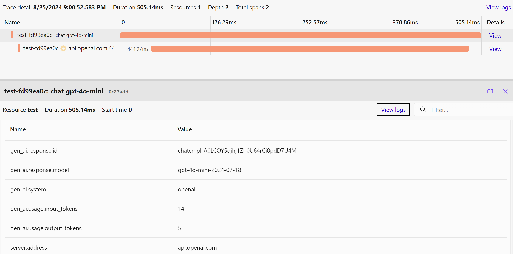

## Observability with OpenTelemetry

> Note:
> OpenAI .NET SDK instrumentation is in development and is not complete. See [Available sources and meters](#available-sources-and-meters) section for the list of covered operations.

OpenAI .NET library is instrumented with distributed tracing and metrics using .NET [tracing](https://learn.microsoft.com/dotnet/core/diagnostics/distributed-tracing)
and [metrics](https://learn.microsoft.com/dotnet/core/diagnostics/metrics-instrumentation) API and supports [OpenTelemetry](https://learn.microsoft.com/dotnet/core/diagnostics/observability-with-otel).

OpenAI .NET instrumentation follows [OpenTelemetry Semantic Conventions for Generative AI systems](https://github.com/open-telemetry/semantic-conventions/tree/main/docs/gen-ai).

### How to enable

The instrumentation is **experimental** - volume and semantics of the telemetry items may change.

To enable the instrumentation:

1. Enable experimental OpenAI telemetry:

   ```csharp
   builder.Services.AddOpenTelemetry()
       .WithTracing(b =>
       {
           b.AddSource("Experimental.OpenAI.*", "OpenAI.*")
             ...
            .AddOtlpExporter();
       })
       .WithMetrics(b =>
       {
           b.AddMeter("Experimental.OpenAI.*", "OpenAI.*")
            ...
            .AddOtlpExporter();
       });
   ```

   Distributed tracing is enabled with `AddSource("Experimental.OpenAI.*", "OpenAI.*")` which tells OpenTelemetry to listen to all [ActivitySources](https://learn.microsoft.com/dotnet/api/system.diagnostics.activitysource) with names starting with `Experimental.OpenAI.` (experimental ones) or sources which names start with `"OpenAI.*"` (stable ones).

   Similarly, metrics are configured with `AddMeter("Experimental.OpenAI.*", "OpenAI.*")` which enables all OpenAI-related [Meters](https://learn.microsoft.com/dotnet/api/system.diagnostics.metrics.meter).

Consider enabling [HTTP client instrumentation](https://www.nuget.org/packages/OpenTelemetry.Instrumentation.Http) to see all HTTP client
calls made by your application including those done by the OpenAI SDK.

Check out [full example](../examples/OpenTelemetryExamples.cs) and [OpenTelemetry documentation](https://opentelemetry.io/docs/languages/net/getting-started/) for more details.

### How to view telemetry

You can view traces and metrics in any [telemetry system](https://opentelemetry.io/ecosystem/vendors/) compatible with OpenTelemetry.

You may use [Aspire dashboard](https://learn.microsoft.com/dotnet/aspire/fundamentals/dashboard/standalone) to test things out locally.

Here's a trace produced by [OpenTelemetry sample](../examples/OpenTelemetryExamples.cs):



### Available sources and meters

The following sources and meters are available:

- `Experimental.OpenAI.ChatClient` - records traces and metrics for `ChatClient` operations (except streaming and protocol methods which are not instrumented yet)
