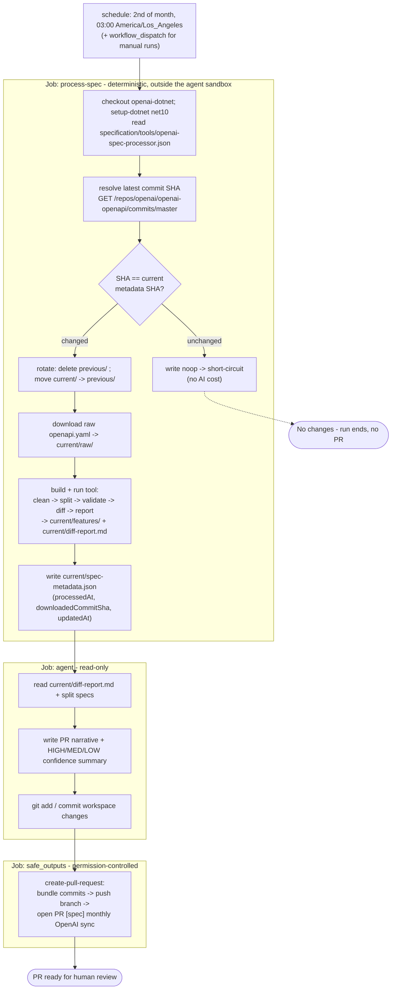

# Design: Automated Monthly OpenAI Spec Sync via a GitHub Agentic Workflow

> **Read this first.** This is the companion working document, kept for its reasoning rather than its
> shape. It records how the design got to where it is: the twelve open questions and how each was
> resolved, the alternatives weighed, the risks, and in Appendix E what actually changed once it was
> built, including every defect a review round turned up.
>
> For the current design as implemented, start with
> [`openai-spec-sync-design.md`](openai-spec-sync-design.md) instead. Where the two disagree, that one
> is right and this one is a historical record. Sections 4.1 through 4.4 in particular describe
> sketches that the implementation moved past; Appendix E is the correction.

| | |
|---|---|
| **Status** | Built as a prototype. All 12 open questions resolved (2026-07-07); implementation and five review rounds recorded in Appendix E. |
| **Scope** | Phase 1: monthly download + preprocessing + PR. TypeSpec editing is a planned **Phase 2** (agentic) — out of scope here but drives the engine choice (§2 roadmap, §5.1). |
| **Target repo** | `openai-dotnet` |
| **Engine** | **gh-aw (Agentic Workflows)**, pinned v0.81.6 — deterministic .NET tool + agentic analysis/PR (Q1). See the ✅ decisions log in §5. |

---

## 1. Summary

Today, refreshing the OpenAI REST API spec into the SDK's 24 per-feature OpenAPI specs is a
**manual, locally-run .NET tool** (`OpenAI.SpecProcessor` / `oai-spec`). This document proposes
replacing that manual process with a **scheduled GitHub Agentic Workflow** (built on
[`github/gh-aw`](https://github.com/github/gh-aw)) that runs **monthly, on the 2nd at 03:00**, inside the
`openai-dotnet` repository.

**What it does each run:** rotate the last processed spec (`current` → `previous`), download the
latest upstream spec, run the existing deterministic processing (clean → split → validate → diff →
report) into a new `/specification/openai/` hierarchy, and **deliver every change as a Pull
Request** for human review.

**Proposed architecture — hybrid "DeterministicOps":**

- A **deterministic tool** (the existing .NET `OpenAI.SpecProcessor`, built from source vendored
  into the repo) performs the exact, idempotent transformation: splitting the ~2.8 MB monolith into
  24 *self-contained* specs and computing the structural diff. This is kept in code because the
  project's own constraints in `copilot-instructions.md` §9 demand *100% diff accuracy*, *idempotent
  output*, and *no hallucination* — guarantees an LLM cannot provide (see Appendix A). The determinism
  comes from running code, not from .NET specifically; reusing the existing .NET tool vs. a Python
  rewrite is analyzed in §3.2.
- The **AI agent** does what LLMs are good at: **interpreting** the diff (significance,
  breaking-ness, HIGH/MED/LOW update confidence) and **authoring** the PR.
- **gh-aw plumbing** (safe-outputs) handles branch/commit/PR creation; the agent itself runs
  read-only.

**The one decision that gates everything (§5.1):** keep the deterministic tool (recommended), or
relax the §9 constraints and let the agent do the processing too. The rest of this design assumes
the tool is kept.

**Repository reality (validated against `openai-dotnet`@main — see §8):** the repo **already has** a
`specification/` directory (TypeSpec codegen input — `main.tsp`, `tspconfig.yaml`, `base/`, `client/`)
and an **analogous scheduled auto-PR workflow**, `update-generator.yml` — *plain* GitHub Actions that
opens a PR via `gh pr create` + `GITHUB_TOKEN` using a **PowerShell** script. Two consequences:
(1) we place our snapshots under **`specification/openai/`** and our processor under
**`specification/tools/`** — new sibling folders that **coexist** with the existing TypeSpec files
(the TypeSpec compiler only consumes the `.tsp` files; our YAML/JSON/console-app folders are ignored
by it, but the console-app project is kept out of the SDK solution/build — see §8.1);
(2) the workflow **engine is gh-aw (Agentic Workflows)** — decided (§5.1) because Phase 1's AI
analysis/summarization in the report is a **first-class, evolving capability** and Phase 2 adds
agentic TypeSpec-edit proposals to the same workflow. The deterministic split/diff still runs as the
.NET tool inside a gh-aw **custom (DeterministicOps) job**; §8 documents the plain-Actions pattern the
repo uses today as the considered alternative.

**Hard requirement:** all output is delivered via a **Pull Request — never a direct push** to
`main`. The repo already demonstrates Actions→PR via the default `GITHUB_TOKEN` (§8.2).

### 1.1 How the pieces fit together (read this first)

It helps to be explicit about the data flow, because it explains *why* this project exists and what
its output is for:

1. **OpenAI publishes a REST API description** as an OpenAPI document
   (`openai/openai-openapi` → `openapi.yaml`). This is the upstream source of truth for the HTTP API.
2. **`openai-dotnet` does not consume that OpenAPI file directly.** Instead it maintains a
   **TypeSpec** definition in `specification/*.tsp`, and a code generator
   (`@typespec/http-client-csharp` + an OpenAI plugin) turns the TypeSpec into the C# SDK. TypeSpec
   is the SDK's source of truth; the OpenAPI file is what the TypeSpec is *meant to mirror*.
3. **The gap:** when OpenAI changes the upstream OpenAPI spec, a human has to notice and update the
   TypeSpec accordingly. Today that awareness is manual.
4. **What this project builds:** an automated job that, on a schedule, downloads the latest upstream
   OpenAPI spec, splits it into 24 per-feature files, and **diffs it against last month's snapshot**
   to produce a clear report of exactly what changed. That report is the **input a maintainer (or a
   later agentic step) uses to decide which TypeSpec edits are needed.**

So this project is a **change-detection and reporting aid for the spec → TypeSpec step** — it does
**not** itself generate the SDK or edit TypeSpec (that is the separate, out-of-scope
`update-typespec` work). Keeping that framing in mind makes the rest of the document — the
deterministic split/diff, the snapshot hierarchy, and the optional AI analysis — easy to follow.

---

## 2. Goals & non-goals

### Goals
1. Fully automate the monthly spec refresh — no manual local runs.
2. Run on a schedule: **the 2nd of each month at 03:00** (timezone to confirm — assumed `America/Los_Angeles`).
3. Persist results in a reviewable `/specification/openai/` hierarchy with `current` + `previous`.
4. Capture provenance: processed date, **source commit SHA**, and updated date.
5. Deliver all changes as a **Pull Request** for human review.
6. Preserve the existing processing guarantees (accuracy, idempotency, self-contained specs).
7. **Provide a first-class, evolving agentic analysis layer** in the report/PR — summarization,
   significance/breaking-ness, and HIGH/MED/LOW update confidence — designed to keep improving over
   time (this is why the engine is gh-aw — §5.1, §3.4).
8. **Support evolving the feature-area mapping**: surface new/`UNASSIGNED` upstream areas and let the
   agent *propose* mapping updates for human approval (§3.4).

### Non-goals (Phase 1)
- **TypeSpec updating** — proposing `.tsp` edits from the diff is **out of scope for Phase 1**, but
  it is a **planned Phase 2** (an agentic step that reads `diff-report.md` and proposes TypeSpec
  changes). Because Phase 2 will extend *this* workflow with non-deterministic decisions, it is a
  primary input to the **engine choice** (§5.1) — see the roadmap note below.
- Changing the feature-area mapping or the spec-processing rules themselves.
- Publishing the processor as a NuGet package (it is built from in-repo source — see §3.1).

### Roadmap (why Phase 2 matters to Phase 1's design)
- **Phase 1 (this document):** deterministic download → split → diff → report, delivered as a PR.
- **Phase 2 (planned):** an **agentic** step that consumes the Phase-1 diff report and **proposes the
  actual TypeSpec (`.tsp`) edits** in a PR — genuinely non-deterministic, edits code that feeds
  codegen, and benefits from agent guardrails. Designing Phase 1 with Phase 2 in mind is what makes
  the workflow-engine decision (§5.1) strategic rather than incidental.

---

## 3. Design overview

This section describes *what* is built and the alternatives considered. For the rationale —
*why* a deterministic core is required at all (a step-by-step "can the agent guarantee this?"
breakdown) — see **Appendix A**.

### 3.1 Recommended design — hybrid



**Tool packaging (decided — it doesn't matter):** the `OpenAI.SpecProcessor` is just a **plain
console application** whose source is vendored into `openai-dotnet` at
`specification/tools/OpenAI.SpecProcessor/` and **executed with `dotnet run` from source** in the
workflow. No NuGet packaging, no global tool, no `dotnet-tools.json` entry — running the committed
source directly means the behavior is always pinned to what's in the repo. (The project is kept out
of `OpenAI.slnx`/the SDK build so it never affects codegen — §8.1.)

**Consequence — drop the Copilot SDK dependency:** today the tool references `GitHub.Copilot.SDK`
only for an *optional* in-tool analysis step. In this design the **optional Copilot/agent step**
performs that analysis instead, so the console app becomes purely deterministic
(clean/split/validate/diff/report). Removing `GitHub.Copilot.SDK` also drops the transitive
`MessagePack`/`Nerdbank.MessagePack` packages that currently raise NU1902/NU1903 vulnerability
warnings — a build-hygiene win.

### 3.2 Language/runtime for the deterministic core — does .NET buy anything?

A fair challenge: if the deterministic part is just code, **does it have to be a .NET tool, or
could a PowerShell/Python script run the same logic right in the workflow?**

**Determinism does not come from .NET.** It comes from running *code* (not an LLM) with stable
serialization. Python or PowerShell could meet the same guarantees if written with the same care.
So the real question is what **reusing the existing .NET tool** buys versus **rewriting** the
deterministic part as an in-workflow script. gh-aw imposes no constraint here — the deterministic
job runs outside the agent sandbox and can be any language available on the Linux runner.

| Factor | Reuse existing .NET tool (recommended) | Python rewrite | PowerShell rewrite |
|---|---|---|---|
| Already exists & tested | ✅ ~28 source files; iterated bespoke report | ❌ net-new | ❌ net-new |
| Output-parity risk at cutover | ✅ none (same binary) | ⚠️ must reproduce byte-identical splits + report, or the first PR is all-noise | ⚠️ same risk |
| Fit with host repo (`openai-dotnet`) | ✅ native toolchain; maintainers are C# devs | ⚠️ foreign artifact in a .NET repo | ⚠️ unusual for logic of this complexity |
| Suited to transitive closure + structural diff | ✅ static types aid non-trivial logic | ✅ good data-munging language | ❌ awkward at this complexity |
| YAML round-trip library | ✅ YamlDotNet (already used) | ✅ `ruamel.yaml` | ⚠️ `powershell-yaml` / `yq` |
| Added workflow weight | ⚠️ `setup-dotnet` + `dotnet build` (trivial at monthly cadence) | ✅ `pip install` + run | ✅ `pwsh` built-in |
| Determinism guarantee | ✅ (code + stable serialization) | ✅ (same discipline required) | ✅ (same discipline required) |

**What .NET specifically buys here** is *not* the determinism, but: (1) **zero rewrite** — the
tool already encodes the exact feature split, the transitive `$ref` closure, and the bespoke
diff report iterated on repeatedly; (2) **repo fit** — `openai-dotnet` is a C# codebase its
maintainers review and own comfortably; (3) **strong typing** for the non-trivial closure/diff
logic.

**What it costs** is one `setup-dotnet` + `dotnet build` per run — negligible monthly, especially
once the `GitHub.Copilot.SDK` dependency is dropped (§3.1).

**If a single in-workflow script is preferred anyway:** **Python** (with `ruamel.yaml`) is the
viable alternative for the *heavy* closure + structural-diff logic — PowerShell is the weakest fit
for that specific logic. Note, however, that **`openai-dotnet`'s scripting convention is PowerShell**
(`scripts/Verb-Noun.ps1`), so the thin **orchestration** layer (rotate, download, SHA, invoke the
tool, create the PR) is naturally a PowerShell script (`specification/tools/Sync-OpenAISpec.ps1`) regardless — only
the heavy split/diff stays in the .NET tool. The catch in *either* rewrite of the heavy logic is
**output parity**: the first run must emit byte-identical splits and an identical report, or the
inaugural PR is pure noise. That is real, careful work for the *same* guarantees the existing tool
already provides.

**Recommendation:** reuse the existing .NET tool for the heavy logic, orchestrated by a PowerShell
script per repo convention (§8.3). The determinism lives in the code, not the language; a rewrite
buys a marginally lighter build while risking output drift and discarding tested logic. Revisit only
if the team explicitly wants to consolidate the repo on one scripting language — in which case
Python, with a parity-tested port.

### 3.3 Alternative considered — fully agentic

The agent reads `copilot-instructions.md` and performs clean/split/diff itself via `bash`/`edit`
tools, with **no deterministic tool**. Viable **only if** the §9 constraints are relaxed: LLM
output is non-deterministic (noisy monthly diffs), completeness over ~959 schemas is unprovable
(missed/invented changes), and regressions are hard to detect. Carried as a real option for the
decision in §5.1.

### 3.4 Where the AI analysis lives — reconciling evolving agentic analysis with idempotency

Phase 1 hosts a **first-class, evolving agentic layer** (better report summarization/analysis, and
help evolving the feature-area mapping — §5.1). That seems to collide with the idempotency guarantee
in Appendix A, but it does not, once you separate the two kinds of output:

- **The comparison baseline is the split feature specs** — `current/features/*.yml` vs.
  `previous/features/*.yml`. These **must stay byte-deterministic** (the .NET tool guarantees it), so
  month-over-month structural detection is complete and free of spurious noise. This is untouched by
  the agent.
- **`diff-report.md` is a human artifact regenerated every run** — it is **not** a comparison input;
  next month's diff is computed from the *specs*, never from the report. Therefore enriching the
  report with **AI summarization/analysis is safe**: it can change run-to-run and improve over time
  without ever feeding back into the deterministic comparison.

So the division of labour is stable even as the agentic layer grows:

| Output | Nature | Owner | Idempotent? |
|---|---|---|---|
| `current/features/*.yml` (split specs) | comparison baseline | **.NET tool** | **Yes — required** |
| structural change detection (added/removed/changed) | comparison baseline | **.NET tool** | **Yes — required** |
| `diff-report.md` prose: summaries, significance, HIGH/MED/LOW, breaking-ness | analysis | **agent (gh-aw)** | No — and that's fine |
| PR narrative | analysis | **agent (gh-aw)** | No — and that's fine |
| **Feature-area evolution**: analyzing `UNASSIGNED` operations (new paths/tags) and proposing mapping updates or new areas | judgment | **agent (gh-aw)**, human-approved | No — proposal only |

**Feature-area evolution** deserves a note: the deterministic tool already **flags `UNASSIGNED`
operations** (new upstream paths/tags that match no current feature area — per
`copilot-instructions.md` §3.3.4). Today that is a human-review flag; the agentic layer can analyze
those flags and **propose** where they belong (or that a new area is warranted), which the human
accepts via the PR. The mapping change itself stays a reviewed edit — the agent proposes, it does not
silently re-map.

---

## 4. Detailed design

### 4.1 Repository hierarchy (in `openai-dotnet`)

```
/specification/                           # EXISTING TypeSpec codegen input (main.tsp, tspconfig.yaml, base/, client/)
├── openai/                               # NEW — our processed REST-spec snapshots (coexist with the .tsp files)
│   ├── current/
│   │   ├── spec-metadata.json            # processedDate, downloadedCommitSha, updatedDate
│   │   ├── diff-report.md                # the rendered markdown diff report
│   │   ├── raw/
│   │   │   └── openapi.yaml               # unprocessed OpenAPI YAML
│   │   └── features/                      # processed split specs (== today's output/spec)
│   │       ├── responses.yml
│   │       ├── ... (24 feature files)
│   │       └── administration.yml
│   └── previous/                          # mirrors current/ ; prior processed version
│       ├── spec-metadata.json
│       ├── diff-report.md
│       ├── raw/openapi.yaml
│       └── features/*.yml
└── tools/                                # NEW — our processor (NOT part of the SDK build/solution)
    ├── openai-spec-processor.json        # the single config (source URL, paths)
    ├── Sync-OpenAISpec.ps1               # PowerShell orchestrator (rotate, download, run, open PR)
    └── OpenAI.SpecProcessor/             # console-app source, executed via `dotnet run`
```

Notes:
- `current/features/` is exactly today's `output/spec/` content.
- The diff compares `current/features` (new) against `previous/features` (old) — the same
  comparison the tool does today, relocated.
- The metadata file (today `.spec-metadata.json`, a dotfile) is de-dotted to `spec-metadata.json`
  so it is visible in the tree, and placed at the `current/` root (see §4.3).

### 4.2 Configuration file

**Location:** `/specification/tools/openai-spec-processor.json`
**Loaded by:** the .NET tool (today it binds `appsettings.json`). Add a `--config <path>` option
(or env var) so the tool reads this file instead of the embedded `appsettings.json`.

```jsonc
{
  "spec": {
    // Raw YAML download (no commit SHA in this URL — see §4.5.3 and §5 item 4)
    "sourceUrl": "https://raw.githubusercontent.com/openai/openai-openapi/master/openapi.yaml",
    // API used to resolve the exact commit SHA of the downloaded file
    "sourceRepo": "openai/openai-openapi",
    "sourceRef": "master",
    "sourcePath": "openapi.yaml",
    "instructionsFile": "copilot-instructions.md",
    "diffReportFile": "diff-report.md"
  },
  "paths": {
    "root": "specification/openai",
    "current": "specification/openai/current",
    "previous": "specification/openai/previous",
    "rawSubdir": "raw",
    "featuresSubdir": "features"
  },
  "ghaw": {
    "engine": "copilot",
    "scheduleCron": "0 3 2 * *",
    "scheduleTimezone": "America/Los_Angeles"
  }
}
```

(Exact field names TBD; this mirrors current settings + the new hierarchy.)

### 4.3 Metadata

Today: `.spec-metadata.json` with `version, source, processedAt, timezone, featureCount`. This
design adds the **download commit SHA** and an **updated date**, and (per Q12) records all
timestamps as **ISO-8601 UTC** — dropping the ambiguous local-abbreviation field so output is
runner-independent:

```jsonc
{
  "version": "2.3.0",                     // info.version from the spec
  "source": "https://raw.githubusercontent.com/openai/openai-openapi/master/openapi.yaml",
  "sourceRef": "master",                  // ref requested (may be overridden on a manual run)
  "downloadedCommitSha": "…",             // NEW: exact SHA of openai/openai-openapi at download
  "processedAt": "2026-07-02T10:00:00Z",  // when processing ran (UTC, ISO-8601)
  "updatedAt":   "2026-07-02T10:00:00Z",  // NEW: when this hierarchy entry was last updated (UTC)
  "featureCount": 24
}
```
*(No `timezone` field — timestamps are UTC. `SpecMetadata.GetLocalTimezoneAbbreviation()` is removed;
see §5 item 12.)*

### 4.4 The agentic workflow file (frontmatter sketch)

Authored as `.github/workflows/openai-spec-sync.md` in `openai-dotnet`; `gh aw compile` generates
the committed `.lock.yml`. Grounded in the gh-aw capability reference (Appendix B):

```yaml
---
on:
  schedule:
    - cron: "0 3 2 * *"            # 2nd of the month, 03:00
      timezone: "America/Los_Angeles"
  workflow_dispatch:               # manual runs — testing & advance copies (see §4.7)
    inputs:
      source_ref:
        description: "openai-openapi ref/branch/SHA to snapshot (default: master)"
        required: false
        default: "master"
        type: string
      force:
        description: "Process even if the source SHA is unchanged (bypass no-op)"
        required: false
        default: false
        type: boolean
      dry_run:
        description: "Produce output as an artifact only — do NOT open a PR"
        required: false
        default: false
        type: boolean

engine: copilot
runs-on: ubuntu-latest
timeout-minutes: 30

permissions:
  contents: read                  # agent is read-only; writes go via safe-outputs
  copilot-requests: write         # preferred: org-billed Copilot inference via Actions token
                                  #            (no PAT). See Authentication §4.5.

network:
  allowed:
    - defaults
    - "raw.githubusercontent.com"
    - "api.github.com"

tools:
  edit:
  bash: [":*"]                    # for git rotate + dotnet run (review exact allowlist)

jobs:
  process-spec:                   # deterministic, outside the sandbox; builds the in-repo tool
    runs-on: ubuntu-latest
    permissions:
      contents: read              # read this repo + read public openai/openai-openapi via API
    outputs:
      changed: ${{ steps.run.outputs.changed }}
      new_sha: ${{ steps.run.outputs.new_sha }}
    steps:
      - uses: actions/checkout@v6
      - uses: actions/setup-dotnet@v4
        with: { dotnet-version: "10.0.x" }
      # Build the vendored tool from source, then run via the wrapper script.
      - run: dotnet build specification/tools/OpenAI.SpecProcessor -c Release
      - id: run
        env:
          GITHUB_TOKEN: ${{ secrets.GITHUB_TOKEN }}   # raises API rate limit for SHA lookup
        run: pwsh ./specification/tools/Sync-OpenAISpec.ps1

safe-outputs:
  create-pull-request:            # writes happen in a separate permission-controlled job
    title-prefix: "[spec] "
    labels: [automation, openai-spec]
    draft: false                  # ready-for-review PR (Q8)
    base-branch: main
    max-patch-files: 400          # 24 feature files + raw + report + previous rotation
    max-patch-size: 16384         # raise: full previous/ rotation is a large patch
---

# Monthly OpenAI Spec Sync

The `process-spec` job has already rotated `current`→`previous`, downloaded the latest
OpenAPI spec, and regenerated `current/features/` + `current/diff-report.md`.

Your tasks:
1. Read `specification/openai/current/diff-report.md`.
2. Summarize the most significant changes and classify update confidence
   (HIGH / MEDIUM / LOW) per `copilot-instructions.md` §6.4.
3. Stage all workspace changes and open a **ready-for-review** pull request describing the sync,
   linking the diff report and noting the downloaded commit SHA
   `${{ needs.process-spec.outputs.new_sha }}`.
```

(Field choices to be finalized; `max-patch-files`/`max-patch-size` likely need raising because the
rotation rewrites the whole `previous/` tree.)

### 4.5 Authentication

> **Validated:** `openai-dotnet`'s existing `update-generator.yml` already opens automated PRs
> with the default **`GITHUB_TOKEN`** via `gh pr create` (see §8.2), so the *GitHub-operations*
> surface below is effectively confirmed for this repo. Only the *AI-inference* surface (§4.5.1)
> remains a question, and only if the AI analysis layer is kept.

Authentication spans three independent surfaces. **None require embedding a long-lived secret** in
the workflow if the org-billed Copilot path is used. Claims below are grounded in the gh-aw auth,
permissions, and pull-request safe-output docs (Appendix B/C).

#### 4.5.1 Engine (Copilot) inference — *recommended: no PAT*

- **Preferred:** grant `permissions: copilot-requests: write`. gh-aw then authenticates Copilot
  inference with the **built-in GitHub Actions token** — no PAT, no repository secret — and
  **billing flows through the org's Copilot subscription**. Natural fit for `openai-dotnet`.
  - **Prerequisite (verify):** the org has a Copilot subscription with centralized billing
    enabled, and the Actions token has Copilot access. If not, inference fails at runtime and we
    fall back to a PAT.
- **Fallback:** `COPILOT_GITHUB_TOKEN` repository secret — a **fine-grained PAT owned by a user
  account** with **Account permissions → Copilot Requests: Read**. PAT lifecycle becomes our
  responsibility.
- **Engine choice impact:** switching off Copilot changes the secret accordingly
  (`ANTHROPIC_API_KEY`, `OPENAI_API_KEY`/`CODEX_API_KEY`, or `GEMINI_API_KEY`). Recommendation:
  stay on Copilot with `copilot-requests: write`.

#### 4.5.2 GitHub write operations (the PR) — *default token, with one org setting to verify*

- The **agent job is read-only** (`contents: read`). All writes are isolated to the separate,
  permission-controlled `safe_outputs` job gh-aw generates; it gets `contents: write` +
  `pull-requests: write` and uses the default **`GITHUB_TOKEN`**. No PAT required for **same-repo**
  PR creation.
- **Org/repo setting to verify:** "Allow GitHub Actions to create and approve pull requests" must
  be **enabled** (Settings → Actions → General → Workflow permissions). If disabled, the API blocks
  `GITHUB_TOKEN` from opening PRs and gh-aw **falls back to creating an issue** (`fallback-as-issue`,
  default on). This is the most likely auth pitfall — it silently degrades PR delivery to issue
  delivery.
- **Branch protection:** if `main` requires reviews/checks, the auto-opened PR simply waits for
  them — desirable here. Confirm no rule *blocks* PR creation by Actions entirely.
- **Broader access (not needed here):** cross-repo writes, triggering CI on the PR, or assigning
  the Copilot coding agent would require a `GH_AW_GITHUB_TOKEN` PAT. Our design needs none of these.

#### 4.5.3 Reading the source spec + its commit SHA — *public, token optional*

- The spec download (`raw.githubusercontent.com/openai/openai-openapi/master/openapi.yaml`) is
  **public** — no auth — but `raw.githubusercontent.com` must be on `network.allowed`.
- The commit-SHA lookup (`GET https://api.github.com/repos/openai/openai-openapi/commits/master`)
  targets a **public** repo and works **unauthenticated**, but unauthenticated calls are rate-limited
  (60/hr/IP). Passing the default `GITHUB_TOKEN` raises the limit to 5000/hr (read of a public repo
  needs no special scope). `api.github.com` must be on `network.allowed`.

#### 4.5.4 Secret hygiene (gh-aw rules)

- **Never** place `${{ secrets.* }}` in the workflow-level `env:` block — gh-aw treats this as a
  compile error in strict mode (the value would be visible to the model). Use engine-specific
  config / job-scoped env instead.
- Prefer the org-billed `copilot-requests: write` path precisely because it means **zero
  long-lived secrets** for inference.
- If a PAT is unavoidable, scope it to the minimum repositories/permissions and store it via
  `gh aw secrets set` or the repo Settings UI.

#### 4.5.5 Authentication summary

| Surface | Mechanism (recommended) | Secret required? | Verify before first run |
|---|---|---|---|
| Copilot inference | `copilot-requests: write` (Actions token, org billing) | **No** | Org Copilot subscription + central billing enabled |
| PR creation | `safe_outputs` job + default `GITHUB_TOKEN` | **No** | "Allow Actions to create & approve PRs" enabled |
| Spec download | Public `raw.githubusercontent.com` | No | `raw.githubusercontent.com` in `network.allowed` |
| Commit-SHA lookup | Public API + default `GITHUB_TOKEN` (rate-limit) | No | `api.github.com` in `network.allowed` |

### 4.6 Execution flow (rotation + download + SHA)

1. **Resolve SHA first** (so we can no-op): `GET /repos/openai/openai-openapi/commits/<source_ref>`
   → `.sha` (`source_ref` defaults to `master`; a manual run may pin a specific ref/SHA — §4.7).
   The raw download URL itself returns no commit SHA, so this API call is required to satisfy the
   "commit SHA we downloaded" metadata requirement.
2. **No-op short-circuit (optional):** if the resolved SHA equals `current` metadata's
   `downloadedCommitSha`, the spec is unchanged → write `noop` to `$GH_AW_SAFE_OUTPUTS` and exit
   before the agent runs (documented cost-saving path). A manual run with **`force=true` skips this
   check** and regenerates anyway (§4.7).
3. **Rotate:** delete `previous/`, move `current/` → `previous/`. Deterministic git/file ops in the
   job (not the agent). **First-run guard:** if `current/` is empty/absent (bootstrap), **skip the
   rotate** so the pre-seeded `previous/` is preserved (Q9).
4. **Download:** fetch raw YAML → `current/raw/openapi.yaml`.
5. **Process:** build + run the tool with the new config; write `current/features/` and
   `current/diff-report.md`; diff against `previous/features/`.
6. **Metadata:** write `current/spec-metadata.json`.
7. **PR delivery (required):** the agent commits the workspace changes to a dedicated branch and the
   `safe_outputs` job opens the PR. **No direct pushes to `main`.** The rotation (step 3) and the
   regenerated `current/` (steps 4–6) are all workspace file changes, captured in the same commit
   bundle and included in the single PR.

### 4.7 Manual runs — testing & advance copies

The workflow does not only run on the monthly schedule; it can be started **on demand** at any time.
Two motivations: **testing** (verify a change to the tool/workflow end-to-end) and pulling an
**advance copy** (OpenAI just shipped a spec change and we want the diff report *now*, before the
2nd, or we want to preview a specific upstream commit/branch). Three ways to trigger, all using the
same `workflow_dispatch` inputs defined in §4.4 (`source_ref`, `force`, `dry_run`):

**1. From the GitHub UI (no tooling needed).**
Actions tab → **"OpenAI Spec Sync"** workflow → **Run workflow** → pick the branch, optionally set
inputs (e.g., `force = true`), → **Run**. This is the simplest path for a non-CLI user.

**2. From the GitHub CLI.**
- *Plain-Actions engine (path 5.1a):*
  ```
  gh workflow run openai-spec-sync.yml -f source_ref=master -f force=true -f dry_run=false
  ```
- *gh-aw engine (path 5.1b):* `gh aw run openai-spec-sync` (or `gh aw trial …` to test without
  committing anything to the repo). `workflow_dispatch` inputs are supported the same way.

**3. Locally, with no GitHub run at all (fastest inner loop for tool testing).**
Run the same orchestrator the workflow runs, pointed at a scratch directory:
```
pwsh ./specification/tools/Sync-OpenAISpec.ps1 -SourceRef master -Force -DryRun
```
`-DryRun` produces `current/` + `diff-report.md` locally and **skips the branch/commit/PR**, so you
can inspect the output (the "advance copy") without touching the repo or opening a PR.

**What the inputs do (shared by all three):**

| Input / param | Effect | Primary use |
|---|---|---|
| `source_ref` / `-SourceRef` | Snapshot a specific `openai-openapi` branch/tag/**commit SHA** instead of `master` | Advance copy of a not-yet-default or pre-release spec commit |
| `force` / `-Force` | Bypass the no-op short-circuit (§4.6 step 2) so it regenerates even when the SHA is unchanged | Re-run after a *tool/report* change (spec unchanged); deterministic re-verify |
| `dry_run` / `-DryRun` | Do the full processing but **do not open a PR** — publish the result as a run artifact (workflow) or leave it on disk (local) | Testing; previewing the diff without a PR |

**Notes.**
- **A normal manual run opens the same ready-for-review PR** (i.e., `dry_run=false`): a manual
  "advance copy" that you *do* want reviewed simply opens that PR early. `dry_run=true` is the
  "just show me, don't open a PR" mode.
- A forced/advance run **still rotates `current` → `previous`** and writes metadata, so it behaves
  identically to a scheduled run (idempotent). If you only want a throwaway preview, prefer the
  **local `-DryRun`** path, which writes to a scratch location and does not disturb the committed
  snapshots.
- The orchestrator accepts these as **parameters** precisely so the workflow step and a local
  invocation run the *same* code path — no drift between "how CI runs it" and "how I test it."

---

## 5. Open questions & decisions needed

> **⟳ Decisions log (this session, 2026-07-07):**
> - **Q1 — Workflow engine: ✅ (b) gh-aw (Agentic Workflows).** Driven by two facts: (1) Phase 1's
>   **AI summarization/analysis in the diff report is a first-class, evolving capability** (not an
>   optional bolt-on) — you want to keep improving the report's analysis and **evolve the feature-area
>   mapping** over time; (2) **Phase 2** adds agentic TypeSpec-edit proposals to the same workflow.
>   Both are genuinely agentic and want gh-aw's guardrails; plain Actions would be a retrofit. The
>   deterministic split/diff still runs as a .NET tool in a gh-aw **custom (DeterministicOps) job**.
> - **Q2 — Keep the deterministic .NET console tool: ✅ decided.** The tool owns the split + structural
>   diff (byte-deterministic); the agent owns interpretation/summary/PR. See the idempotency
>   reconciliation in §3.4.
> - **Q3 — Copilot inference auth: ✅ `copilot-requests: write`** (assume org centralized billing is
>   enabled → Actions-token inference, no PAT, no secret). `COPILOT_GITHUB_TOKEN` remains the
>   documented fallback if a dry-run 403s at inference. (Org has Copilot — proven by `record-test.yml`.)
> - **Q4 — Source commit SHA: ✅ resolve via `GET /repos/openai/openai-openapi/commits/<source_ref>`**
>   (public; default `GITHUB_TOKEN` for rate limit) and store `.sha` in `spec-metadata.json`.
> - **Q5 — Branch protection: ✅ resolved by evidence.** `main` is protected via an active
>   **"Required checks" ruleset**; `update-generator.yml` already opens Actions-authored PRs against
>   it, so our PR opens fine and just requires checks/review to merge (the desired behavior).
> - **Q6 — gh-aw version: ✅ pin to v0.81.6** (latest stable as of 2026-06-27; clear of the retired
>   0.68.4–0.71.3 range) for authoring/compiling; commit the SHA-pinned `.lock.yml`; periodic
>   bump review.
> - **Q7 — Engine + budget: ✅ Copilot engine, default `max-ai-credits: 1000`** (monthly cadence +
>   bounded "summarize one diff" task → default is comfortably generous).
> - **Q8 — PR flavor: ✅ ready-for-review PR** (not draft), with **raised patch limits**
>   (`max-patch-files: 400`, `max-patch-size: 16384`) so the full `previous/` rotation fits in one PR.
> - **Q9 — Bootstrap: ✅ seed `previous/` from today's working copy** (our existing `output/spec` +
>   report + metadata). The first run **skips rotation** (because `current/` is empty), downloads
>   fresh into `current/`, and diffs against the seeded `previous/` → a real delta on run #1.
>   Subsequent runs rotate normally.
> - **Q10 — Triggers: ✅ schedule + `workflow_dispatch` only for now.** `repository_dispatch` from
>   `openai/openai-openapi` is noted as a **future enhancement** (needs upstream/relay to send it).
> - **Q11 — Timezone: ✅ `America/Los_Angeles`** — "3am on the 2nd" = 3am PST/PDT via gh-aw's
>   `timezone:` field (cron `0 3 2 * *`).
> - **Q12 — Metadata time: ✅ ISO-8601 UTC**; drop the local-abbreviation field (remove
>   `GetLocalTimezoneAbbreviation()`), so metadata is unambiguous and runner-independent.
>
> **➡ All 12 open questions are now resolved.** Remaining items below are kept as annotated records.


> **Already settled (no longer open):**
> - **Delivery is a Pull Request, never a direct push to `main`.** (§1, §4.5.2, §4.6)
> - **Root location is `specification/openai/`** (your direction) for the snapshots, with the
>   processor under `specification/tools/` — new sibling folders that coexist with the existing
>   TypeSpec files (§8.1).
> - **Tool packaging does not matter:** it is a plain **console app executed via `dotnet run`** from
>   the in-repo source (no NuGet packaging, no global tool). (§3.1)
>
> **Resolved by inspecting `openai-dotnet`@main (see §8):**
> - **`specification/` is the TypeSpec codegen input.** We add `specification/openai/` and
>   `specification/tools/` alongside the `.tsp` files; the console-app project is kept out of the SDK
>   solution/build so it cannot affect codegen.
> - **PR via `GITHUB_TOKEN`:** the existing `update-generator.yml` already opens auto-PRs with
>   `gh pr create` + the default `GITHUB_TOKEN` (`contents`+`pull-requests: write`) — so PR
>   delivery from Actions is proven in this repo (old item "PR-creation org setting" closed).
> - **.NET SDK:** `global.json` pins **10.0.100** (`setup-dotnet` reads `global-json-file`) — the
>   console app's `net10.0` target is correct (old "net10 SDK?" closed).
> - **Scripting convention:** repo orchestration is **PowerShell** (`Verb-Noun.ps1`) — so the
>   orchestrator is `specification/tools/Sync-OpenAISpec.ps1`, not bash.

1. **Workflow engine — gh-aw vs. the repo's existing pattern (the biggest decision):**
   `openai-dotnet` already has `update-generator.yml`: a **plain scheduled GitHub Actions** workflow
   that runs `scripts/Submit-GeneratorUpdatePr.ps1` to open an auto-PR (no AI involved). The choice:
   - **(a) Convention-aligned plain Actions.** Build spec-sync the same way `update-generator.yml`
     works: a scheduled Actions workflow whose steps run our PowerShell orchestrator + `dotnet run`
     console app, then open the PR with `gh pr create`. The AI diff-analysis is an optional add-on
     (a Copilot step that writes the summary into the PR body). Pros: matches a pattern the team
     already maintains; no new framework/secrets. Cons: the AI step is self-wired; and it is a
     **dead-end for Phase 2** (see below) — a large agentic TypeSpec-editing step bolted onto a
     plain-Actions workflow is awkward and lacks guardrails.
   - **(b) gh-aw (Agentic Workflows).** Use gh-aw as the engine: a **deterministic custom job** runs
     the .NET tool (identical correctness), and an **agentic job** interprets the diff and authors
     the PR via guardrailed safe-outputs. Pros: agentic analysis + safe PR-creation are first-class;
     and — decisively — it is **the natural host for Phase 2.** Cons: new tooling/`.lock.yml`,
     version-pinning, Copilot-inference auth, and an org-level adoption decision in a shared repo.
   - **Roadmap consideration (Phase 2 — the deciding factor):** you intend to grow *this* workflow
     with **non-deterministic decisions that update TypeSpec based on the report's deltas** — i.e., an
     agent that reads `diff-report.md` and **proposes `.tsp` edits** in a PR. That step is genuinely
     agentic, edits code that feeds codegen (higher-risk), and benefits directly from gh-aw's
     read-only-agent + sanitized safe-outputs + human-approval model. If Phase 2 is firm, doing
     Phase 1 (spec-sync) in gh-aw now is a **coherent beachhead**: one framework, one set of
     secrets/auth, one PR mechanism, and the team ramps once instead of retrofitting later.
   - **Re-weighed recommendation:** **(b) gh-aw**, *given the stated Phase-2 intent.* The
     determinism story is unchanged (the .NET tool runs in a custom job either way); what gh-aw buys
     is a home for the agentic work you know is coming. Choose (a) only if Phase 2 is uncertain or far
     off, in which case start simple and migrate the analysis/TypeSpec step to gh-aw when needed.
   - **Sequencing option (c):** even with (b), you may still want the **spec-sync report/snapshot PR
     to stay purely deterministic** (no AI) and introduce the agent only for the **TypeSpec-proposal**
     PR — either as a second agentic job in the same gh-aw workflow, or a separate gh-aw workflow
     triggered off the snapshot. This keeps "what changed upstream" and "proposed `.tsp` change" as
     distinct, separately-reviewable PRs. (A Phase-2 design detail, noted here so the engine choice
     accounts for it.)
2. **Keep the deterministic tool, or go fully agentic? (core decision):** Per Appendix A, the tool's
   irreducible value is the three things an LLM cannot guarantee: complete transitive `$ref` closure
   + verbatim schema copy, an exhaustive **idempotent** diff (output committed and re-diffed monthly —
   non-determinism = spurious-diff noise every month), and the bespoke report. **Recommendation: keep
   the tool (hybrid, §3.1)** unless the `copilot-instructions.md` §9 constraints (100% accuracy /
   idempotency / no hallucination) are relaxed, in which case the fully-agentic option (§3.3) drops
   the tool entirely.
   - **Sub-decision — language of the deterministic core (§3.2):** reuse the existing .NET tool for
     the heavy split/diff; the **orchestrator is PowerShell** (matching `scripts/*.ps1`). Note: the
     repo's convention makes PowerShell-for-orchestration natural (correcting the earlier "PowerShell
     not recommended" framing, which referred only to the heavy closure/diff logic).
3. **Copilot inference auth — ✅ DECIDED: `copilot-requests: write`** (assume org centralized
   billing). Rationale/evidence: the org demonstrably has Copilot — `record-test.yml` runs "on behalf
   of the Copilot Coding Agent" (a paid feature). This path uses the Actions token (no PAT, no
   secret). `COPILOT_GITHUB_TOKEN` is the documented fallback if a dry-run 403s at inference.
   GitHub-operations auth is already settled — `GITHUB_TOKEN` handles the PR (§8).
4. **Commit SHA capture — ✅ DECIDED: yes.** Resolve via
   `GET /repos/openai/openai-openapi/commits/<source_ref>` (public; default `GITHUB_TOKEN` raises
   the rate limit) and store `.sha` in `spec-metadata.json`. Enables the no-op short-circuit and the
   provenance requirement.
5. **Branch protection on `main` — ✅ RESOLVED (by evidence).** `main` reports `protected: true`,
   enforced via an active **"Required checks" ruleset** (the classic protection endpoint 404s because
   rulesets are used). The existing `update-generator.yml` already opens Actions-authored PRs against
   `main`, so our auto-PR opens fine and simply requires checks/review before merge — the intended
   behavior. No blocker.
6. **gh-aw version pin — ✅ DECIDED: v0.81.6** (latest stable, 2026-06-27; clear of the retired
   0.68.4–0.71.3 range). Author/compile with it and commit the SHA-pinned `.lock.yml`; schedule a
   periodic bump review (releases are frequent).
7. **Engine + budget — ✅ DECIDED: Copilot engine, default `max-ai-credits: 1000`.** Monthly cadence
   plus a bounded "summarize one diff report" task means the default budget is comfortably generous;
   revisit only if the analysis scope grows substantially.
8. **PR flavor & patch limits — ✅ DECIDED: ready-for-review PR** (not draft), with **raised patch
   limits** (`max-patch-files: 400`, `max-patch-size: 16384`) so the full `previous/` rotation fits in
   a single PR. (`update-generator.yml` commits large regenerated code with the same token approach.)
9. **Bootstrap / first run — ✅ DECIDED: seed `previous/` from the working copy.** Commit today's
   processed working copy (`output/spec` + report + metadata) as the initial **`previous/`**. The
   first run **skips the rotate step** (guarded on empty `current/`), downloads fresh into `current/`,
   and diffs against the seeded `previous/` → the first PR shows a genuine delta. Subsequent runs
   rotate normally (`current/` → `previous/`).
10. **Triggers — ✅ DECIDED: schedule + `workflow_dispatch` only** for now. `repository_dispatch`
    from `openai/openai-openapi` (event-driven on upstream release) is a **future enhancement** —
    it requires the upstream repo (or a relay) to send the dispatch, which we don't control. The
    repo precedent (`repository_dispatch: [typespec-release]`) makes it a clean add later.
11. **Timezone — ✅ DECIDED: `America/Los_Angeles`.** "3am on the 2nd" = 3am PST/PDT via gh-aw's
    `timezone:` field on the cron (`0 3 2 * *`). (The repo's `update-generator.yml` uses plain UTC,
    but we prefer local-time semantics here.)
12. **Cross-platform metadata — ✅ DECIDED: ISO-8601 UTC.** Store `processedAt`/`updatedAt` as UTC
    ISO-8601 and **remove** the local-abbreviation field (`SpecMetadata.GetLocalTimezoneAbbreviation()`
    is deleted). Unambiguous and identical on any runner. (Independent of the *schedule* timezone in
    Q11 — that's when it runs; this is how timestamps are recorded.)

---

## 6. Risks

- **Determinism erosion** if processing moves into the agent (mitigated by the hybrid design).
- **Divergence from repo convention** if gh-aw is chosen: `openai-dotnet` automates PRs with plain
  Actions + PowerShell (`update-generator.yml`); introducing gh-aw adds tooling/secrets the team
  doesn't otherwise use. Mitigation: prefer the convention-aligned path (§5.1) unless the agentic
  analysis clearly justifies gh-aw.
- **PR downgraded to an issue** only if "Actions can create PRs" is off — **low risk**: the repo's
  `update-generator.yml` already opens PRs with `GITHUB_TOKEN` (§8.2), so this is effectively proven.
- **Engine auth failure** *(only if the AI layer is kept)* if `copilot-requests: write` is used
  without org Copilot billing enabled — runs fail at inference (§4.5.1). Verify or provision the PAT.
- **Large diffs / patch limits:** rotating `previous/` rewrites many files; raise patch-size limits
  or PR creation may be truncated/blocked. (`update-generator.yml` commits large regenerated code
  with the same token approach, so the mechanism is viable.)
- **Source URL drift:** ownership already moved once (Stainless → GitHub). Centralizing the URL in
  `openai-spec-processor.json` limits the blast radius of a future move.
- **gh-aw maturity** *(only if gh-aw is chosen)*: fast-moving project with a recent billing-bug
  release retirement; pin versions and watch release notes.

---

## 7. Implementation plan (after the §5 decisions are resolved)

1. **Repo prep:** create `specification/openai/` (`current/`, `previous/`) and `specification/tools/`
   (holding `openai-spec-processor.json` + the console-app source); add the orchestrator
   `specification/tools/Sync-OpenAISpec.ps1`; **seed `previous/` from today's working copy**
   (`output/spec` + report + metadata) per Q9. Ensure the console-app project is **excluded from
   `OpenAI.slnx`/the SDK build**.
2. **Vendor + slim the tool:** copy `OpenAI.SpecProcessor` source into
   `specification/tools/OpenAI.SpecProcessor/` as a plain console app; **remove the
   `GitHub.Copilot.SDK` dependency** and the in-tool Copilot analysis (the optional Copilot step now
   performs analysis); confirm it builds and runs on Linux via `dotnet run`.
3. **Tool changes:** add `--config <path>` loading; add commit-SHA resolution + extended metadata
   (`downloadedCommitSha`, `updatedAt`); parameterize the new hierarchy paths; normalize timezone
   for Linux.
4. **Orchestrator script:** `specification/tools/Sync-OpenAISpec.ps1` with parameters
   `-SourceRef` (default `master`), `-Force`, `-DryRun` (see §4.7): resolve SHA → no-op check
   (unless `-Force`) → rotate → download → `dotnet run` the tool → write metadata → open PR / set
   outputs (skipped when `-DryRun`). The same script is used by the workflow and by local runs.
5. **Workflow authoring:** wire the `workflow_dispatch` inputs (`source_ref`, `force`, `dry_run`)
   through to the orchestrator. *Path (a)* add a plain scheduled Actions workflow (modeled on
   `update-generator.yml`) that runs the orchestrator and `gh pr create`; *path (b)* instead write
   the gh-aw `openai-spec-sync.md` and `gh aw compile`. (See §5.1.)
6. **Auth & settings:** confirm "Actions can create PRs" (already proven via `update-generator.yml`);
   for the optional AI step, confirm Copilot inference auth (org billing or PAT); pin action SHAs.
7. **Dry run (two levels):** first **local** — `pwsh Sync-OpenAISpec.ps1 -DryRun` to a scratch dir
   (fast inner loop, no PR); then **CI** — `workflow_dispatch` with `dry_run=true` (artifact only),
   then `dry_run=false` to verify a **ready-for-review PR** (not an issue) is created. (§4.7)
8. **Enable schedule:** confirm the 2nd-of-month 03:00 cadence; monitor the first scheduled run.
9. **Decommission:** retire the manual local-run process; keep the vendored console-app source as the
   engine.

---

## 8. Repository context (validated against `openai-dotnet` @ `main`)

Findings from a direct inspection of the live repository (via the GitHub API, 2026-06-30). These
drove the adjustments above. This is primary evidence, not assumption.

### 8.1 `specification/` is the TypeSpec codegen input — we add sibling folders inside it

The repo's `specification/` directory holds **TypeSpec** source, not OpenAPI YAML:
`main.tsp`, `main.responses.tsp`, `tspconfig.yaml`, and `base/` + `client/`. The SDK is generated
from it via the `@typespec/http-client-csharp` emitter plus an `@open-ai/plugin`
(`emitter-output-dir: "{project-root}/.."`).

**Decision (your direction):** keep `specification/openai/` as the snapshot root and put the
processor under `specification/tools/`. These are **new sibling folders next to the `.tsp` files**,
not nested inside the TypeSpec models, so there is no name collision. Two practical safeguards make
this clean:

- The **TypeSpec compiler only consumes `.tsp` files** (driven by `tspconfig.yaml`); our YAML/JSON
  snapshots and the PowerShell script are ignored by it.
- The **console-app C# project under `specification/tools/` is kept out of `OpenAI.slnx` and the SDK
  build**, so it cannot be accidentally compiled into or interfere with the generated SDK. (This is
  the one real risk of placing C# under `specification/`; excluding it from the solution removes it.)

### 8.2 An analogous scheduled auto-PR workflow already exists — `update-generator.yml`

`.github/workflows/update-generator.yml` is a close cousin of what we are building:

- **Plain GitHub Actions** (not gh-aw). Triggers: `schedule: cron '0 9 * * 1'` (weekly Mon 09:00
  UTC), `workflow_dispatch`, and `repository_dispatch: [typespec-release]`.
- `permissions: contents: write, pull-requests: write`; **SHA-pinned** actions; `setup-node@…` 22.x;
  `setup-dotnet@…` with `global-json-file: global.json`.
- It checks npm for a newer `@typespec/http-client-csharp`, then runs
  `pwsh ./scripts/Submit-GeneratorUpdatePr.ps1 -AuthToken ${{ secrets.GITHUB_TOKEN }} …`.

`Submit-GeneratorUpdatePr.ps1` creates a branch (`git checkout -b typespec/update-…`), commits,
`git push`, and opens the PR with **`gh pr create`** using `$env:GH_TOKEN = secrets.GITHUB_TOKEN`,
with a richly templated PR body linking the Action run. **Implications:**

- **PR-from-Actions via the default `GITHUB_TOKEN` is proven here** — the earlier "Allow Actions to
  create PRs" worry is effectively resolved.
- There is an **established in-repo pattern** (plain Actions + PowerShell + `gh pr create`) that our
  spec-sync should mirror for consistency — see the §5.1 engine decision.

### 8.3 Conventions to adopt

| Area | Repo convention (evidence) | Our adjustment |
|---|---|---|
| Scripting | PowerShell, `scripts/Verb-Noun.ps1` (`Export-Api`, `Invoke-CodeGen`, `Submit-GeneratorUpdatePr`, …) | Orchestrator = `specification/tools/Sync-OpenAISpec.ps1` (PowerShell, not bash; co-located with our tool per your layout) |
| .NET SDK | `global.json` → `10.0.100`, `rollForward: feature`; `setup-dotnet` via `global-json-file` | Console app `net10.0` aligns; workflow reads `global.json` |
| Actions | All actions SHA-pinned | Pin ours too |
| PR auth | default `GITHUB_TOKEN` + `gh pr create` | Same — no PAT needed for the PR |
| Triggers | schedule + `workflow_dispatch` + `repository_dispatch` | Add optional `repository_dispatch` from `openai/openai-openapi` (§5.10) |
| Local tools | `.config/dotnet-tools.json` present | Not needed — the processor is run via `dotnet run`, not a packaged tool |

### 8.4 Purpose, clarified

The SDK is generated from **TypeSpec**, not from the split OpenAPI specs. Our split + diff report is
therefore a **human aid that tells maintainers which upstream REST changes require TypeSpec edits** —
it is the natural input to the (still out-of-scope) `update-typespec` work, which is where an
agentic step would propose the actual `.tsp` changes. This sharpens *why* the AI analysis layer is
valuable and where it ultimately points (and it is the same relationship spelled out in §1.1).

### 8.5 Net effect on open questions

Closed by evidence: net10 SDK target ✓, PR-from-Actions via `GITHUB_TOKEN` ✓, location confirmed as
`specification/openai/` (coexists with TypeSpec) ✓. Newly opened: the workflow engine (gh-aw vs. the
repo's plain-Actions pattern) and optional `repository_dispatch` triggering (§5).

---

## Appendix A — Why a deterministic core (value boundary)

A natural question is: if the **agent** does the analysis and **MCP / safe-outputs** do the
git/file plumbing, what is the deterministic tool actually *for*? Several steps the tool performs
today are **not** tool value and should move out of it — but a hard core remains that an LLM agent
**cannot guarantee**, precisely because of `copilot-instructions.md` §9 (*100% diff accuracy*,
*idempotent processing*, *no hallucination*, *self-contained specs*).

Walking every step and asking "can an LLM agent guarantee this?":

| Pipeline step | Nature | Can the agent guarantee it? | Correct owner |
|---|---|---|---|
| Rotate `current`→`previous` | file move | ✅ trivially | **shell / MCP — not the tool** |
| Download raw spec | HTTP GET | ✅ | **shell / MCP** |
| Resolve source commit SHA | API call | ✅ | **shell / MCP** |
| Clean: strip `x-oaiMeta`/`x-oaiTypeLabel` at every depth, drop excluded paths, prune orphan tags | mechanical whole-tree transform (~617 fields) | ⚠️ recall risk at scale; **not byte-idempotent** | deterministic code |
| Split: assign 237 operations to 24 features by exact tag/path rules | rule application + ambiguity resolution | ⚠️ mostly, but silent misassignment on edge cases | deterministic code |
| Split: **transitive `$ref` closure** over ~959 schemas (fixed-point) | graph reachability | ❌ completeness is unprovable; deep refs get missed | **deterministic code — core value** |
| Split: copy each reachable schema **verbatim** into a self-contained spec | exact transcription at scale | ❌ hallucination / silent drop risk | **deterministic code — core value** |
| Validate: no dangling `$ref`, full operation coverage, no excluded content | exhaustive checks | ⚠️ partial recall | deterministic code |
| Diff vs. `previous`: ops/schemas/properties/enums/renames/duplicates/anomalies | exhaustive structural compare | ❌ recall problem; **non-idempotent** | **deterministic code — core value** |
| Render the bespoke diff report (line indexes, collapsible sections, rename/dup/anomaly detection) | serialization | ⚠️ non-idempotent if the agent writes it | deterministic code |
| **Interpret** the diff: significance, breaking-ness, HIGH/MED/LOW TypeSpec confidence | judgment | ✅ **this is the agent's strength** | **agent** |
| Author the PR narrative | writing | ✅ | **agent** |
| Branch / commit / open PR | plumbing | ✅ | **safe-outputs / MCP** |

**Bottom line — the tool's irreducible value is the three ❌ rows:**

1. **Transitive `$ref` closure + verbatim schema copy** — turning the 2.8 MB monolith into 24
   *self-contained* specs requires a complete reachability closure over ~959 schemas, copied
   exactly. An LLM cannot *prove* it caught every transitive ref, and *will* occasionally invent
   or drop a property when transcribing hundreds of schemas. The tool does this completely and
   identically every run.
2. **Exhaustive, idempotent diff** — the output is **committed and re-diffed every month**.
   Determinism is not a nicety: if serialization or change-detection wobbles run to run, every
   monthly PR fills with **spurious diffs** and real changes get lost in the noise.
3. **The bespoke report format** (renames, structural-equivalence/duplicate detection, anomalies,
   line references, collapsible sections) — tailored logic, not a generic capability.

Everything else (rotate, download, SHA, PR plumbing, *interpretation*) is **not** tool value and
is handed to the agent or to MCP/safe-outputs.

**Could the determinism be off-the-shelf instead of this bespoke tool?** Partly — a YAML-library
script could clean/split and a tool such as `oasdiff` could diff. But no off-the-shelf tool
produces the **24-feature self-contained split** or **this report format**, and having the agent
*write the processing scripts each run* reintroduces non-determinism. So the determinism belongs
in **committed, version-controlled code**; the existing tool already encodes the assignment rules,
the closure, and the report.

**If the §9 constraints are relaxed** (accept occasional missed/invented changes and
non-idempotent, noisy monthly diffs), the tool could be dropped and the agent could do everything.
That is the product decision in §5.1.

---

## Appendix B — GitHub Agentic Workflows (gh-aw) capability reference

Supporting reference for the design above. All findings were read directly from the official source
repository **`github/gh-aw`** (the project moved from `githubnext/gh-aw`; the old URL 301-redirects).
Citations are to files under `github/gh-aw/main/docs/src/content/docs/`. These are primary sources,
not AI summaries.

| Capability | Finding | Source file |
|---|---|---|
| **What it is** | Write agentic workflows in natural-language markdown; compile to GitHub Actions `.lock.yml`; run hosted coding agents in Actions. | `introduction/how-they-work.mdx` |
| **Engines** | GitHub Copilot (default), Claude (Anthropic), Codex (OpenAI), Gemini (Google). | `introduction/how-they-work.mdx`, `setup/quick-start.mdx` |
| **Security posture** | Read-only by default; writes only through sanitized `safe-outputs`; SHA-pinned deps; tool allow-listing; compile-time validation. | repo README, `reference/safe-outputs.md` |
| **Scheduling** | `on: schedule:` supports raw cron **plus an optional `timezone:` IANA field**. Example: `cron: "30 9 * * 1-5"` + `timezone: America/New_York`. | `reference/triggers.md` |
| **Deterministic steps** | `steps:` (pre-agent), `pre-agent-steps:`, `post-steps:`, and full custom `jobs:` run **outside the firewall sandbox** with standard Actions security. Custom jobs expose `outputs` consumable in the agent prompt. | `reference/steps-jobs.md` |
| **Mixing compute + AI** | Explicitly supported; named the **"DeterministicOps"** pattern. | `reference/steps-jobs.md` |
| **Bash** | `bash:` tool; default safe commands only; `bash: [":*"]` for unrestricted (cautioned). | `reference/tools.md` |
| **PR creation** | `safe-outputs.create-pull-request`: agent's git commits are bundled and a **separate permission-controlled `safe_outputs` job** pushes the branch and opens the PR. Supports `base-branch`, `labels`, `reviewers`, `draft` (policy), `max-patch-files` (default 100), `max-patch-size` (default 4096 KB). | `reference/safe-outputs-pull-requests.md` |
| **Runners** | Linux only (`ubuntu-latest`/24.04/22.04/arm). **macOS and Windows are NOT supported.** | `reference/frontmatter.md` |
| **Auth (basic)** | Copilot engine needs a `COPILOT_GITHUB_TOKEN` repo secret (fine-grained PAT with *Copilot Requests: Read*), distinct from `GITHUB_TOKEN`. Other engines use their own API-key secret. | `setup/quick-start.mdx`, `reference/auth.mdx` |
| **Auth (preferred for orgs)** | `permissions: copilot-requests: write` authenticates Copilot inference with the **built-in GitHub Actions token** — no PAT, no secret; billing via the org's Copilot subscription. Requires org Copilot subscription with centralized billing. | `reference/permissions.md`, `reference/auth.mdx` |
| **GitHub-ops token** | Non-inference GitHub ops use `GITHUB_TOKEN` by default; optional `GH_AW_GITHUB_TOKEN` PAT for broader/cross-repo access. Fallback: custom `github-token` → `GH_AW_GITHUB_TOKEN` → `GITHUB_TOKEN`. | `reference/auth.mdx`, `reference/safe-outputs-pull-requests.md` |
| **PR-create fallback** | `create-pull-request` "falls back to opening an issue if PR creation is blocked (e.g. org settings)"; `fallback-as-issue: false` disables. | `reference/safe-outputs-pull-requests.md` |
| **Network** | `network.allowed:` domain/ecosystem allowlist controls agent egress. | `reference/frontmatter.md` |
| **Compile/CLI** | `gh extension install github/gh-aw`; author `.md`, run `gh aw compile` to (re)generate the committed `.lock.yml`; both files committed. | `setup/quick-start.mdx` |
| **Cost guardrails** | `max-ai-credits:` (default 1000), `max-daily-ai-credits:`. | `reference/frontmatter.md` |
| **Known issue** | Releases **0.68.4–0.71.3 are retired** due to a billing-impacting bug; pin a known-good newer release. | repo README |

**Why this fits:** because deterministic Actions steps/jobs are first-class and run outside the
agent sandbox, the compiled .NET tool runs verbatim in a custom job and the agent adds value on top
— no need to reimplement processing as natural-language instructions.

## Appendix C — Source citations (primary, github/gh-aw @ main)

- `docs/src/content/docs/introduction/how-they-work.mdx`
- `docs/src/content/docs/setup/quick-start.mdx`
- `docs/src/content/docs/reference/triggers.md`
- `docs/src/content/docs/reference/safe-outputs.md`
- `docs/src/content/docs/reference/safe-outputs-pull-requests.md`
- `docs/src/content/docs/reference/tools.md`
- `docs/src/content/docs/reference/frontmatter.md`
- `docs/src/content/docs/reference/steps-jobs.md`
- `docs/src/content/docs/reference/permissions.md`
- `docs/src/content/docs/reference/auth.mdx`
- repo README (`github/gh-aw`)

---

## Appendix E — What changed when this was actually built

Everything below was discovered while implementing against the live `openai-dotnet` clone. Where it
contradicts the body of this document, this appendix is correct.

### E.1 Layout and naming (as built)

| Concern | Designed | Built |
|---|---|---|
| Orchestrator | `specification/tools/Sync-OpenAISpec.ps1` | `scripts/Sync-OpenAISpec.ps1` — the repo puts all PowerShell under a root `scripts/` folder |
| Config | `specification/tools/openai-spec-processor.json` | unchanged |
| Tool source | `specification/tools/OpenAI.SpecProcessor/` | unchanged |
| Snapshots | `specification/openai/{current,previous}/` | unchanged |
| Workflow | `.github/workflows/openai-spec-sync.md` | unchanged, plus the generated `.lock.yml` and `.github/aw/actions-lock.json` |

Three feature areas were renamed to match the repository taxonomy: `video` became `videos`,
`batches` became `batch`, and `moderation` became `moderations`.

The split then grew from nineteen areas to twenty-four, to follow the repository's own breakdown.
The authoritative statement of that breakdown is the folder set on disk under
`specification/base/typespec`, not the "Available Areas" table in
`.github/skills/ingesting-spec/file-locations.md`; that table is stale and omits five areas that
exist on disk. Five areas were split out of the ones that had absorbed them:

| New area | Was folded into | Paths |
|---|---|---|
| `graders` | `fine-tuning` | `/fine_tuning/alpha/graders/**` |
| `uploads` | `files` | `/uploads/**` |
| `threads` | `assistants` | `/threads`, `/threads/{thread_id}` |
| `messages` | `assistants` | `/threads/{thread_id}/messages/**` |
| `runs` | `assistants` | `/threads/runs`, `/threads/{thread_id}/runs/**` |

The exclusions were re-examined at the same time and deliberately kept. `/chatkit/**`,
`/completions`, `/realtime/sessions`, and `/realtime/transcription_sessions` are all surface the SDK
does not carry, so tracking them would add month-over-month noise to every report in exchange for
signal nobody would act on. The consequence worth naming is that the validator's operation-coverage
check proves coverage of every *non-excluded* operation, which is a narrower claim than it reads as.
If the SDK ever picks up one of those surfaces, the exclusion list is the first place to look.

### E.1.1 The bug that split uncovered

`FeatureAreaConfig` had declared, from the beginning, that Fine Tuning excludes
`/fine_tuning/alpha/graders` and that Evals claims it. Neither ever happened. `FindFeatureArea`
matched on tags first and returned immediately, without consulting the area's
`ExcludedPathPrefixes`, so the grader operations were pulled into Fine Tuning by their `Fine-tuning`
tag before path matching was ever reached. The configuration had been expressing an intent the
matcher silently discarded.

The fix is small: a feature that disclaims a path does not get it, however the operation was tagged.
It matters beyond graders, because it is the only mechanism by which a sub-area can be carved out of
a tag its parent owns. All of the assistants operations carry a single `Assistants` tag, so `threads`,
`messages`, and `runs` exist only because `assistants` can now disclaim `/threads` by path.

### E.1.2 Two workflow-level adjustments

`integrity-checks.yml` triggered on `specification/**`, so every monthly sync pull request would have
kicked off a full code generation and API export validation with nothing to say about a snapshot.
`specification/openai/**` and `specification/tools/**` are now excluded from that trigger.

`agentic-lockfile-check.yml` was added. GitHub Actions runs `openai-spec-sync.lock.yml`, not the
markdown that generates it, so an edit that was never recompiled would change nothing and warn about
nothing. The check reinstalls the pinned `gh-aw` extension, recompiles, and fails if the generated
output differs from what is committed — the same shape as the guard `integrity-checks.yml` already
applies to generated code.

### E.1.3 What a review pass caught

A review of the tool surfaced three things worth recording, one of which was a live defect.

**Unassigned paths were invisible.** The splitter reported paths it could not place as a console
warning and nothing else. They reached neither the report nor the metadata, while the workflow prompt
instructed the agent to look for `UNASSIGNED` in the diff report, where it never appeared. Scenario 5
of the design document, the one about noticing a brand-new feature area, did not work. Unassigned
paths are now written to `.spec-metadata.json` and to a callout placed *above* the summary table,
since a path that belongs to no feature cannot be found in a report organized by feature.

This was not theoretical. The first run after the fix flagged `/content_provenance_checks`, which
upstream had added two days earlier and which the previous run had dropped without a word. It is a new
top-level resource that takes an image or audio upload and reports whether the file carries known
OpenAI provenance signals. It is untagged and matches no prefix in the feature map, the repository has
no TypeSpec folder for it, and it postdates the API reference taxonomy the split was reconciled
against. It was deliberately left unassigned, so that it stays in the callout of every report until
the SDK decides whether to carry it.

The reviewer's suggestion to fail the run on an unassigned path was not taken. Failing suppresses the
pull request, and the pull request is the thing that carries the proposal to a human. Loud and
delivered beats blocked and unseen.

**An unrecognized reference kind was skipped silently.** The splitter builds closure over
`#/components/schemas/` only, and the validator skipped any reference that did not match that prefix.
Today that is safe, because upstream's `components` contains nothing but `schemas` and all 2,383
references are schema references. It would stop being safe the moment upstream introduced a shared
parameter or response component: the feature file would be missing it and validation would pass. An
unsupported reference kind is now an error.

**The report claimed more than it delivers.** The structural diff is deliberately scoped and does not
compare serialization details, request-body encodings, response headers, callbacks, or links, and the
rename, duplicate, and anomaly detectors are similarity heuristics rather than facts. Neither was
stated anywhere in the output. The report now opens with both, because a report that looks exhaustive
and is not is worse than one that says where it stops.

The review also raised a set of findings against `CopilotOrchestrator`, `UpdateTypeSpecCommand`,
in-process Copilot invocation with `--allow-all`, and missing commit-pinned provenance. Those apply to
the original standalone prototype, not to the vendored tool. The vendored processor carries no Copilot
dependency and no TypeSpec command, and provenance has recorded the resolved commit and a content hash
since the source switch described below. The separation the review recommends is the arrangement that
was already built.

### E.1.4 What a second review pass caught

A second review followed, again aimed largely at the standalone prototype rather than the vendored
tool.  Its claims about the workflow granting the agent `edit` and unrestricted `bash` were checked
against the real frontmatter and are not accurate: the agent gets `contents: read`, a six-command
bash allow-list of `cat`, `ls`, `head`, `tail`, `wc`, and `grep`, no edit tool at all, and a prompt
that explicitly forbids touching anything under `specification/openai/`.  Four findings were real.

**Rotation could destroy the baseline.** The orchestrator deleted `previous/`, moved `current/` into
its place, and only then downloaded and processed.  A failure anywhere after that point left the
workspace with no valid `current/` and the old baseline already shifted underneath it.  CI workspaces
are disposable, but the design promises that local and CI runs behave identically, and locally that
is a real loss.  Processing now writes to a staging directory in temp, and the rotation happens only
after the tool exits successfully.  Verified by pointing a run at a URL that is not a specification:
the run failed and all 52 snapshot files were untouched.

**Metadata read failures were ambiguous.** A missing or malformed content hash was treated the same
as a hash that did not match, which quietly forces a rotation on corruption.  The handling now splits
by what the metadata is being used for.  The orchestrator's no-op check is a correctness input, so it
throws on malformed or hash-less metadata rather than guessing.  `SpecMetadata.Load`, which supplies
descriptive context for the report, degrades to null with a warning.

Worth recording as a hazard: changing the shape of a metadata field breaks reading the *previous*
snapshot, which was written by the older code.  Widening `unassignedPaths` from strings to objects
did exactly that and killed a run.  Any future metadata shape change needs both sides of the baseline
reseeded.

**Unassigned paths needed enough context to act on.** A bare path list forces the maintainer back into
the raw specification to learn anything.  The callout is now a table carrying the path, its HTTP
methods, operation IDs, tags, and the reason nothing matched.  Excluded paths are recorded separately
in metadata, since excluded and unassigned are both absent from the snapshot but mean opposite things.

**The scope disclaimer needed to be machine-readable.** Prose in a report header does not help a
downstream agent that is parsing it.  A `diffScope` block now goes into `.spec-metadata.json` with a
version and three lists: what is compared, what is not, and which findings are heuristic.

Two more items were taken up on their merits rather than as defects.  A test project was added,
covering diff idempotence on identical input including discriminators and compositions, the YAML
repair and its `<|endoftext|>` false positive, feature routing precedence and exclusions, unassigned
path context, and reference closure validation.  Thirty-five tests, all passing.  One of them asserts
that the feature area map matches the folder set under `specification/base/typespec`, which is the
taxonomy drift check the review asked for; it makes a regrouping on either side a reviewed change
rather than a silent one.

Because `integrity-checks.yml` no longer watches `specification/tools/**`, those tests would never
have run in CI, so `spec-tooling-checks.yml` runs them on pull requests touching the tooling, the
TypeSpec folder set, or the sync script.

The review's suggestion to treat `package-split-proposal.md` as a taxonomy input was set aside.  That
proposal is not assumed to be moving forward, and the split follows the repository's existing
specification area structure.

### E.1.5 What a third review pass caught

The third pass was the most productive, because two of its items turned up live defects that the
earlier rounds had not reached.

**A degenerate source published an empty snapshot over a good one.** This is the serious one. The
orchestrator's rotation was already failure-atomic, but only against failures the processor reported.
A document that parsed cleanly and carried no recognizable API surface, which is what a source URL
serving the wrong file looks like, processed "successfully": zero feature areas, zero validation
results, exit code 0. The orchestrator then did exactly what it was told and published that over the
top of a real snapshot, rotating the good one into `previous` and, on a second run, out of existence.
It was found by running the real orchestrator against crafted sources over a local listener, and it
destroyed the working snapshot when it fired.

Two things were wrong and both are fixed. A split producing no feature areas is now a failed run.
And validation failure, which previously printed `ISSUES` and exited 0, now exits non-zero: a feature
document that is not self-contained fails the single promise the split exists to make, so publishing
it is worse than failing.

**Staging leaked on every failure.** Cleanup lived on the success path, so each failed run left a
full staging directory in temp. Six had accumulated. Cleanup moved into the `finally`, with a dry run
as the deliberate exception since its staged output is the deliverable.

The verification now covers a failure at each stage: download, parsing, sanitization, splitting,
validation, and the degenerate-source case. All six fail with the snapshot byte-identical and no
staging left behind.

**Metadata states were collapsed.** Missing, legacy, malformed, and unsupported-version were being
read through a single "is there a hash" test. A `schemaVersion` field now distinguishes them, and both
halves of the pipeline classify the same five ways. Only `Missing` proceeds, since that is the
bootstrap case; the rest either read cleanly or stop. Legacy is detected from the raw document rather
than the deserialized record, because an absent property leaves the record's default in place and
would make an old file look current.

**Unassigned paths repeated as new every month.** A gap that was reviewed and deliberately left open,
which is precisely the state `/content_provenance_checks` is in, would have re-announced itself as a
fresh finding in every report forever. Each entry is now labelled `new`, `unchanged`, or `resolved`
against the previous snapshot, and resolved entries are reported but not carried into the next
baseline.

**Reference kinds were one prefix test.** Local schema, local component, local non-component, and
external are now classified separately, and the error names the kind, since supporting a shared
parameter component is not the same work as inlining an external document. Fixtures cover parameters,
responses, request bodies, headers, and three shapes of external reference.

**Taxonomy exceptions were hardcoded in a test.** They now live in
`specification/tools/taxonomy-exceptions.json`, each with a required reason, so an intentional
regrouping is a declared change rather than an edited assertion. A second test asserts every declared
exception still names something real, so the list cannot rot into suppressing a check nobody decided
to suppress.

**Scope changes could read as API changes.** When the previous snapshot was produced under a different
`diffScope.Version`, the report now says so and says which direction, because widening the comparison
surfaces findings that were always true and narrowing it hides ones that still are.

**Forced-run determinism is now stated rather than assumed.** Measured, not asserted: a forced rerun
of identical content changes exactly two things, `processedAt` in the metadata and the generated-at
timestamps in the report header. All 24 feature files and every structural finding are byte-identical.
That is written down in `CONTRIBUTING.md`, and two tests guard the byte-level half of it.

The workflow prose also claimed rotation happened before processing, which stopped being true in the
previous round, and never said who stages files or creates the branch. It now states plainly that the
agent does none of that: safe outputs collect the working tree, create the branch, and open the pull
request.

The test suite is at 66.

### E.1.6 What a fourth review pass caught

The fourth pass was almost entirely about tightening claims that were true but under-evidenced, which
is a fair place for a review to land once the live defects have been dealt with.

**The baseline had to be readable by more than its own writer.** The metadata enum had just moved
from numeric to name representation, and nothing proved a file written by the old shape could still
be read. It can: `JsonStringEnumConverter` accepts integer input on read, so a legacy `"status": 1`
still resolves. That is now a test rather than an assumption, alongside a round trip for every value
of the enum and a case for a document that predates the field entirely, which reads back as `New`.

**Dry-run cleanup was conditioned on the wrong thing.** The exception carved out in the previous
round was `-not $DryRun`, which kept staging for *every* dry run rather than every successful one. A
failed local experiment left a partial snapshot in temp with nothing to distinguish it from valid
output. The condition is now `$DryRun -and $processingSucceeded`, verified against a real failing dry
run and a real succeeding one.

**The forced-run contract only covered what one run happened to move.** It now covers every field in
the metadata file with a stated reason for changing or not changing, and says plainly that a
timestamp-only diff should not open a pull request. It cannot, in practice, because the content-hash
check stops the run before that point; `-Force` exists to bypass that check for local diagnosis, and
its output is meant to be discarded rather than committed.

**Validation and publication were coupled by reasoning rather than by test.** The `--no-diff` path
skips the report but not the exit code, which was correct but unproven. `PublicationGateTests` now
drives the real command through both paths for a dangling reference and for a degenerate source, and
asserts that a failed run leaves the directory it was pointed at untouched.

**Resolved gaps needed their life cycle written down.** A resolved path is reported in the month it
resolves and then leaves the baseline, so it is said once. The consequence is that a path falling out
of the map again later reads as `new`, which is right: a routing regression is new information rather
than a continuation. A test walks all five months of that cycle.

**Provenance lived only in the metadata.** The report stated no source, no commit, and no content
hash, so a reviewer had to open a JSON file to answer the first question they would have. A "Where
this came from" section now renders the source URL, the resolved commit, both sides of the content
hash comparison, the feature count, the metadata schema version, the comparison scope version, and
whether the sanitizer repaired anything. It is written from the same record that is saved to disk, in
the same run, so the two cannot disagree.

The test suite is at 87.

### E.1.7 What a fifth review pass caught

Four items, and one of them turned up a real hole.

**The no-op check only asked whether the source moved.** It answered "did upstream change" while
quietly assuming the answer to "would we produce the same thing anyway". That assumption fails the
month someone edits the feature map, the exclusions, the sanitizer, or the comparison scope: upstream
is still, the scheduled run short-circuits, and the committed snapshot goes on describing itself with
a taxonomy the tool no longer uses. Nobody notices, because the run that would have shown it never
happened.

A `ProcessingIdentity` now fingerprints the behavior alongside the content, and the no-op check
requires both to match. Most of it is derived rather than declared, since a number someone has to
remember to bump is a number that will eventually be wrong: the feature map, the output file names,
the tags, the prefixes, and every exclusion rule are hashed directly, so adding an area changes the
identity on its own. Two hand-maintained constants cover what cannot be derived, the split and diff
logic and the sanitizer. The tool answers for its own identity through an `identity` subcommand, so
the orchestrator does not carry a second implementation that could drift.

**A forced run could still open a timestamp-only pull request.** `-Force` bypasses the input check
by design, and nothing downstream re-examined the output, so the documented contract ("a timestamp-only
diff should not open a PR") was a statement of intent rather than a property of the system. The
orchestrator now compares staged output against the committed snapshot, over the generated feature
files and the metadata with the run timestamp removed, and publishes nothing when they match.
Measured: a forced run against identical content now reports `changed=false` and leaves the snapshot
byte-identical.

That fix also closed a case nobody had raised. An upstream edit landing entirely in an excluded path
or a stripped documentation key moves the source hash but produces byte-identical output. That used
to be a pull request with nothing in it. It is now correctly nothing.

The workflow boundary was tightened to match, and this exposed a documentation claim that was simply
false: the design said the deterministic steps "short-circuit before the agent starts", but the agent
job had no such condition and would run every month regardless. The agent is now told to read a
status marker first and stop without reading anything else if there is nothing to report, with the
pull request step's no-changes behavior as the backstop behind it.

**Numeric enum compatibility depended on declaration order.** Legacy numeric values were readable,
but only because the ordinals happened to line up. Inserting or reordering a member would have left
every old file deserializing successfully and meaning something different, which is worse than
failing to read: a `Resolved` coming back as `Unchanged` is a gap that reopens itself in the report
with no defect anyone can point at. The values are now explicit, the persisted mapping is pinned by
test rather than the declaration that produces it, and legacy numbers are rewritten by name on the
next write so the old representation drains out.

Writing that test found a second gap: a numeric value no member defines was being accepted silently.
An unrecognized status now reads as malformed metadata, which is the honest answer.

**The snapshot file count was hardcoded at 26.** A fixed number turns an intentional feature-area
addition into a brittle failure whose obvious fix is to edit the number, which is exactly the moment
nobody looks at what actually landed in the folder. The expected set is now derived from the feature
map, with the metadata file and the report named individually, and a separate check that nothing
unexpected is sitting in the snapshot.

The test suite is at 111.

### E.2 The source document


The upstream is `openai/openai-openapi`, tracked at `openapi.yaml` on the default branch, which is
`main` rather than the `master` the design assumed.

That document does not parse under a strict YAML reader. Around line 61690 it contains:

```yaml
example: |+
<12 spaces>
nullable: true
```

A block scalar with no line of content at all, whose one leading line is made entirely of spaces
indented past the block. The YAML specification forbids a leading empty line from carrying more
spaces than the first line with content, and with no such line the block indentation falls back to
the parent, so YamlDotNet rejects it with "found extra spaces in first line". More lenient readers,
including the one OpenAI generates the file with, accept it.

`SpecSanitizer` repairs this before parsing. It walks the document, and for each block scalar it
blanks any whitespace-only line that precedes the first line with content and is indented past it.
The repair is deliberately narrow rather than a blanket "strip trailing whitespace", so that a real
change upstream cannot be silently normalized away, and it is announced in the run output rather
than applied silently. It is safe by construction: a leading empty line in a block scalar contributes
a line break and nothing else regardless of how many spaces it carries, so there is no valid reading
of the document that it changes. Blocks with an explicit indentation indicator (`|2`) are skipped,
because those do not auto-detect and so cannot hit this case.

The repair applies to the parsed document only. The recorded content hash is taken over the bytes as
downloaded, so provenance still describes exactly what upstream published.

### E.2.1 Provenance

Every run resolves its ref to a commit through the GitHub API and then downloads from a URL pinned to
that commit. This costs one extra API call and buys two things: the snapshot can never be half of one
revision and half of another because upstream pushed mid-run, and every snapshot is exactly
attributable. The metadata records all three of the pinned URL, the commit, and a SHA-256 of the
downloaded document.

The no-op check is content-hash based rather than commit based, deliberately. A commit that touches
other files in the upstream repository moves the SHA without moving the specification, and there is
no reason to spend a pull request on that.

### E.3 Deterministic work runs in the agent job, not a separate job

The design put the .NET tool in a gh-aw custom `jobs:` block. That does not work: custom jobs run on
their own runner, so the files the tool produces never reach the agent's workspace. The tool runs as
a top-level `steps:` block instead, which executes in the agent job after checkout, outside the
firewall sandbox, with the output sitting in the working tree where the agent and the
`create-pull-request` safe output can both see it.

The quiet-month path got better as a result. When the content hash is unchanged, the step writes a
`noop` entry to `$GH_AW_SAFE_OUTPUTS` and the harness exits before the engine starts, so a quiet
month costs no inference at all.

### E.4 Corrections to the frontmatter sketch

- `max-patch-size` is measured in KB and is capped at `10240`. The sketch's `16384` fails to compile.
  A full rotation is roughly 3.6 MB of content, so 10 MB is comfortable.

- Inline `${{ inputs.* }}` expressions inside a `run:` block get hoisted into environment variables
  by the compiler as an injection guard, which mangles conditional argument construction. The step
  reads the inputs from `env:` and builds the argument list in PowerShell instead.

- Ecosystem identifiers are preferred over individual hostnames in `network.allowed`, so the list is
  just `defaults` and `github`.

- `copilot-requests: write` is confirmed as real, supported frontmatter, and it causes gh-aw to
  ignore `COPILOT_GITHUB_TOKEN` entirely for inference.

### E.5 Two real bugs found and fixed

- **Phantom discriminator changes.** `SpecDiffer` emitted a `Changed` entry for `discriminator`
  whenever a discriminator was *present*, not when it *changed*. Comparing a snapshot against an
  identical copy of itself produced 56 changes. This is precisely the "the PR becomes noise" failure
  mode this document warns about, and it would have shipped in the first real report.

- **Pinned ref, unpinned download.** The orchestrator resolved `-SourceRef` to a commit SHA and
  recorded it, but the tool downloaded from the fixed configured URL. An advance copy would have
  reported provenance that did not match its own content. The script now downloads from the resolved
  ref and hands the file to the tool.

- **Provenance recorded a temp path.** The metadata took its `source` from whichever file was handed
  to the processor, which after the fix above is a staging copy in the temp directory. Snapshots were
  recording a local scratch path as their origin. The orchestrator now passes the resolved URL
  explicitly via `--source-url`.

### E.6 Repository standards

- The `.editorconfig` C# rules were dead. `[src/*/{Custom.*}/**.cs]` matches nothing, because the
  real paths are `OpenAI/src/Custom/...`; so was `[sdk/*/{Azure.*,System.*}/**]`. The section was
  broadened to `[*.cs]` with `generated_code = true` exclusions for `**/src/Generated/**.cs` and
  `api/*.cs`. This is safe because every rule is `suggestion` or lighter and neither
  `EnforceCodeStyleInBuild` nor `EnableNETAnalyzers` is set anywhere.

- `.gitattributes` is `* text=auto eol=lf`, so every file the tool emits is written through an
  LF-normalizing helper. Without it, CRLF output would be rewritten on commit and the byte-stability
  the comparison depends on would be lost.

- The tool project opts out of the repo-wide signing, documentation, and packaging defaults, targets
  `net10.0` alone, and takes its dependency versions from a scoped `ItemGroup` in
  `Directory.Packages.props`. It is absent from `OpenAI.slnx`, so it never enters the SDK build.

### E.7 Verified

Byte-determinism across repeated runs (24 of 24 files identical), zero reported changes between
identical snapshots, LF endings throughout, clean `dotnet build OpenAI.slnx` with no warnings, clean
`gh aw compile` with no warnings in strict mode, and both headline scenarios exercised locally: a run
that produces a snapshot, and a follow-up run that correctly does nothing.
